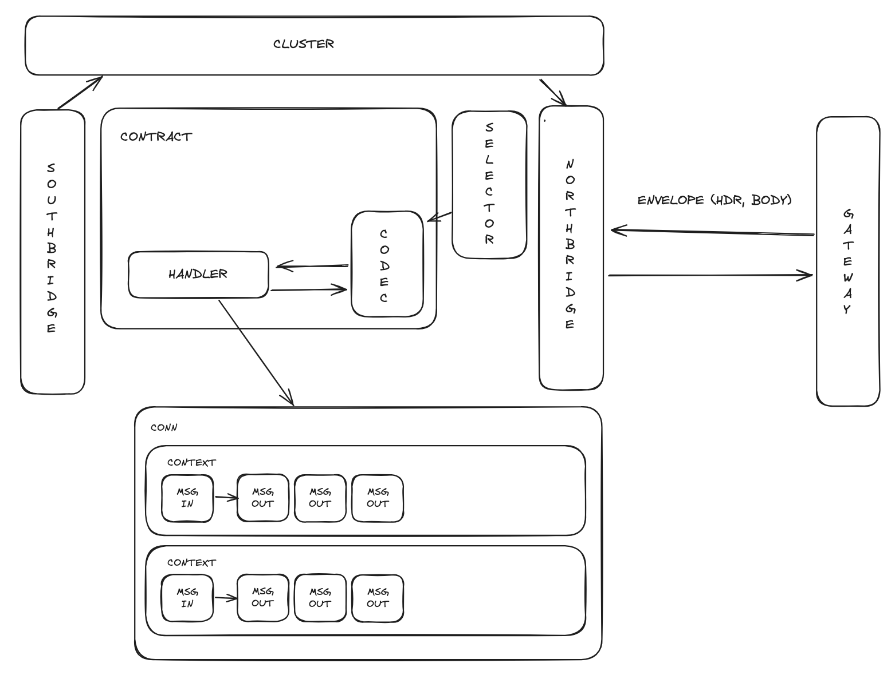
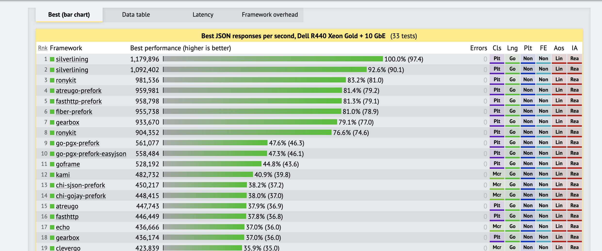

# RonyKIT

[](https://codecov.io/gh/clubpay/ronykit)
[](https://app.fossa.com/projects/git%2Bgithub.com%2Fclubpay%2Fronykit?ref=badge_shield&issueType=license)
[](https://goreportcard.com/report/github.com/clubpay/ronykit)


RonyKIT is a collection of tools designed to be both extendable and flexible, enabling the rapid development of a
complete API/Edge server.
With the RonyKIT framework, you can create API handlers that support both RPC and REST style APIs without the need to
rewrite the
endpoint layer multiple times. The philosphy of Ronykit is to define the most used building blocks of the software as
proper minimal
viable interfaces and provide some standard implementations which make onboarding very quick and also let you to
implement your own
if you have a very specific case. The declarative force of defining contracts in Ronykit makes extending the code much
easier and
by the help of proper templating you can write the usecase and let the most boilerplates like stubs, tests, deployments
etc to be
auto-generated.

If you are seeking a framework to develop your API/Edge server, you can directly use the `rony` package. This package
provides an
intuitive framework, leveraging Go Generics to offer a clean and user-friendly API. This is the recommended approach for
using
the RonyKIT framework. However, if you require greater control over your API server and have concerns about performance
and
memory usage, you can directly utilize the `kit` package, which forms the core of the RonyKIT framework.



## For more information about the `rony` package, visit [rony](./rony/README.MD).
#### For more information about the `kit` package, visit [kit](./kit/README.MD).
#### For more information about the `stub` package, visit [stub](./stub/README.MD).

# Getting Started

Read the [Getting Started Guide](./GETTING_STARTED.MD) to learn how to get started with RonyKIT.

# Performance

Benchmarks may not provide precise measurements of a framework's performance; however, they can offer
insights into the overhead a framework might introduce to your actual business logic. You can see a
[benchmark](https://www.techempower.com/benchmarks/#hw=ph&test=json&section=data-r22&l=zijocf-cn3) as a reference to
evaluate how Ronykit performs in comparison to other Go frameworks.



### Project Structure

RonyKit is organized as a Go workspace with multiple modules:

- **Core modules**:
	- `kit`: Core toolkit and utilities
	- `rony`: Main server implementation
	- `flow`: Workflow-related functionality
	- `stub`: Stub generation utilities
	- `boxship`: Build/deployment tools
	- `ronyup`: Project setup and upgrade tools
	- `contrib`: Contributions and extensions
	- `util`: Utility packages

- **Standard implementations**:
	- Clusters: `p2pcluster`, `rediscluster`
	- Gateways: `fasthttp`, `fastws`, `silverhttp`

- **Examples**: Various example applications demonstrating different features

### Build Commands

The project uses a Makefile for common operations:

```bash
# Install required tools
make setup

# Run tests
make test

# Clean up the project
make cleanup

# Update version (patch)
make new-version-patch

# Update version (minor)
make new-version-minor
```
